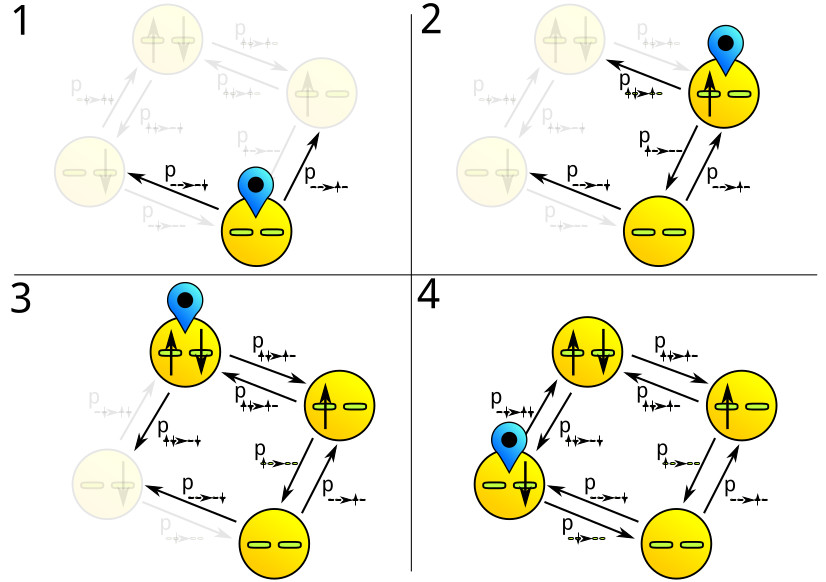

# Simulation of Finite-State-Quantumsystems

## Introduction

This is a library that can be used as a backend for simulations of
quantum systems with a finite number of energy states. The library includes
multiple analytical and numerical solvers for ODEs. Everything is implemented in
a way that should make it easy to setup simulations, run code with
parallelisation and save the result in a human and machine readable fashion.

## Interpretation of a Quantum System as Graph

A graph is a number of nodes that are connected by edges. A quantum system can be
interpreted as a graph. The states of the system are the nodes in the graph. The
occupation of a state at a given time can be stored in the nodes. The
edges in the graph represent the transition processes that can occur. The
edge weights represent the rate at which these processes occur. The
following image shows an example of a system with one energy level that can
hold two electrons, one spin up, the other spin down.

The system is charge coupled with an electron reservoir. The edges, connecting
the states represent tunneling from electrons in the level of the system or out
of the level. It is important to notice the difference between a state of the
system and the levels that the system has. In many sources these terms are used
somewhat loosely. 
The whole physics of the system is encoded in the edges of the graph. The
probabilities depend on the tunneling barrier, the density of states in the
reservoir and the occupation. 
This second example highlights the role of the edges. In addition to the
tunnel-coupling spin flip processes are taken into account.

Notice the two additional edges that are now present.  
Using graphs, we can create an intuitive way to break up the large problem of
simulating a system with multiple physical processes (like e.g. tunneling
and spin flip) in to smaller problems: Finding functions that calculate the edge
weights. 
Another advantage is, that, once the edge weights are known, the process of
getting a time-evolution of the occupation of states doesn't differ from system
to system. The process of solving a system with known transition rates and given
initial occupation is implemented in this library. This way, the mathematical
problem of getting a solution is out of the way and one can focus on the
physics- Getting the weights of the edges.

## Library Structure

### Dependencys

This library is coded in C++ and uses some content defined in the C++17
standard. It uses Armadillo as a backend for linear algebra calculations. It
also uses jsoncpp to export json files. Under Linux, compile with the following
command: 

	g++ your_main_class_here.cpp -std=cpp17 -O3 -larmadillo -lpthread -ljsoncpp -I cpp -o your_desired_output_path.out

### The Quantum System

The QuantumSystem is the central class of the library. It holds a graph that
represents a QuantumSystem. It stores the occupation data and the weights of the
edges during the simulation and can save this data as .graphml file. The big
advantage of saving as .graphml is, that the information of the physics involved
in the simulation is stored together with the desired solution; the occupation
data. All measured quantities can be obtained with post processing. 

The Experiment class is the central interface to manage parallel processing and
the storage of metadata. The terminology works as follows: We think of the
simulation of one quantum system as of the simulation of one time evolution during
a experiment. Often experiments consist of multiple time-evolutions processes.
Like e.g. in conductance or capacitance spectroscopy, where the system is
charged and discharged multiple times. 
The Experiment represents a set of measurements and the corresponding metadata.
The Experiment class also coordinates which quantum system is simulated with
which solver, and how many processes are running in parallel. 

Solver : The solvers in this library can -form a structural standpoint- roughly
be divided in two classes. One class are solvers that work on the master equation
matrix of the system (Which is very similar to the adjacency matrix of the
graph). In this class are the analytic solutions and the ODE solvers.  The
other class consists of algorithms that work on the graph itself. At this time,
the only solver that does this is the MontecarloWanderer algorithm. 

To use the Experiment class and the QuantumSystem the user has to derive a
specific implementation. (See Examples)

## Structure of saved content

The Saved content looks as follows: 

The user has to specify a folder for the storage of the data. After the
simulation, the folder should contain two metadata files: METADATA.json and
METADATA.csv. In addition to that, there should be a number of .graphml files.
Most of the management is done automatically, if the interface for the
Experiment is implemented correctly. 

### METADATA.json
This file should be used for data for humans. Things in natural language, like
descriptions, motivations and expectations. The physical quantities that are
constant during the experiment are also stored here.

### METADATA.csv
In every experiment there are quantities that are varied from measurement to
measurement (but are constant for one measurement). This could be f.e. the
varying bias voltage in CV-spectroscopy or  conductance spectroscopy. This file contains a table. The filename of the measurements and
the values of the changing physical quantities are noted here.

### \*.graphml
The data generated during the Simulation is saved as GraphML file. This File
contains the Nodes, Their time dependent occupation and the edges and their
time dependent weights. This Way, not only the occupation but also the structure
of the system is saved. The great advantage of this format is, that the Physics,
that was taken into account during the simulation is also saved with the data.
The disadvantage is that one will have to extract measurement data one would see
in a experiment from this file via post processing. It is recommended to use a
Software like Gephi or a script-language like python in conjunction with
networkX or a xml-parser to extract the data. After the extraction post processing can be done in
every ones software of choice.

This file also contains a small description of the system and its energy levels
written in xml.

## Parallelisation

A Experiment consists of multiple measurements, i.e. multiple time evolutions of
the system under test. Since the parameters for the experiment are known
apriori, one can parallelise the simulation of the measurements. The
parallelisation in the project is schematically illustrated below:

There are multiple threads running in parallel. All of which, except one are
worker threads. The coordination of those threads is done by using one boolean
variable and a queue in shared memory. There are methods in the global scope to
manage access on the memory. 
Pending jobs are stored in the queue (WorkSource). The Workerthreads will wait, until there
are jobs in the queue. A job is a QuantumSystem and a Solver. Once there are
jobs, The WorkerThread will process them as follows: The QuantumSystem is solved
using the provided Solver. The data is than saved to the file system and Solver
and QuantumSystem are deleted, since they where stored as dynamic memory. When
there is no job in the Queue the Worker thread will continue to wait for new jobs.
The Waiting eventually ends, when the boolean, named Running, is turned false
by the management thread. All worker threads will than stop running and can be
joined with the management thread. 
The management thread will observe the status of the WorkSource queue. If there
are to few jobs in the queue, the management thread will generate new ones after
a specification in the Experiment class. New jobs are allocated in dynamic
memory. 
Since (roughly spoken) only the jobs that are processed are stored in dynamic
memory, the whole process works somewhat inplace.

## Solvers and Solutions

As mentioned above (Library Structure) the solvers in this project can be
roughly divided in two classes. One being the algorithms that work on the
master equation of the system which shows great similarities with the adjacency
matrix of the graph. The other class is working directly on the graph. 
All solvers share a common parent class: Solver. This class defines the things
that every solver should implement to be compatible with the library. If you are
interested in the exact way the other solvers are derived from Solver, take a
look at the inheritance diagram in its class file.

### Master-Equation-Approach

The master equation is a generalized rate-equation. It is a first order ODE.
However, there are a view cases where it is possible to obtain an analytical
solution to the master equation. Examples are master equations with a constant
matrix and special cases such as master equations with periodic coefficients,
where a solution can be obtained via Fourier transformation.

#### Analytical Solution

Up to the current moment no analytic solution is implemented but there are plans
on implementing the solution for master equation with constant coefficients in
the near future.

#### Numerical Solution using ODE-Solvers

In this library, the solvers are separated from the numerical step schemes used.
There is an abstract class called SingleStepScheme that defines how a numerical
single step scheme should look like. You can create a sub-class of it if there
is a scheme you are missing. All solvers accept schemes that behave like the
SingleStepScheme class. This way you can use every solver with every scheme. Up
to now there are only two solvers. One is a ODE-Solver with fixed step width. The
other is a adaptive step width solver, which uses a method based on
Richardson-extrapolation to guess a good step width (i.e. it solves the ODE with
two step widths and calculates an estimated value for the error and the ideal
step width).

<!--
###Monte-Carlo-Wanderer

The MonteCarloWanderer is a algorithm that works on the graph itself. It is a
exploration algorithm. This algorithm has some huge drawbacks and some
advantages over the ODE-Solvers and the analytical solutions.  
The Main disadvantage is that it is a Monte Carlo-Method and as such it is
inefficient, because it needs extensive calculation to archive convergence. 
The main advantage is, that it is a Monte Carlo-Method, which means that, (at
least intuitively ,Nothing is proven yet..) it should also work good on
problems with no analytical Solutions that can't be solved by ODE Solvers.). 
But how does this algorithm even work?  
The algorithm explores the graph at random. At each step it draws a random node
out of the graph. The probability that a node is chosen is weighted by the
occupation at the begin of the time step. A random transition is chosen,
weighted according to the edges. The final
node after the transition is stored in a histogram. The values of the histogram
bins normalized with the number of transitions simulated this way equal the
occupation values for the next step.
The picture below shows a stepwise graph exploration.

-->
## Notation: Identifying states

In the whole project a specific notation to denote QuantumSystem-states is used.
With the notation a unique number is assigned to every state. 
When a subclass of the quantum system is created the levels are specified by the
user. The levels
are passed as an array. Thus, every level can be identified with its position
in the array. 
To assign a number to a state a binary string is constructed. For every state
each level is evaluated. If the level is occupied in the given state, the
corresponding digit of the binary string is 1. If the level is not occupied it is
0. the corresponding bit is the one that is at the same index as the position of
the level in the array. The decimal representation of this binary string is the
identification number of the state. Here are some examples:  
These are the given level: [s1,s2,p1,p2,p3,p4]

	* The state where no level is occupied would be denoted as binary 000000 or decimal 0
	* The state where every level is occupied would be binary 111111 or decimal 63
	* The state where only level p4 is occupied would be binary 000001 or decimal 1
	* The state where only level s1 is occupied would be binary 100000 or decimal 32
	* The state where level p2 and s1 are occupied would be binary 100100 or decimal 35

Obviously the numbers are only usefull if the position of the level in the
array is known and they can change if this position is altered. So it is
important to keep track of this orientation in the metadata.
